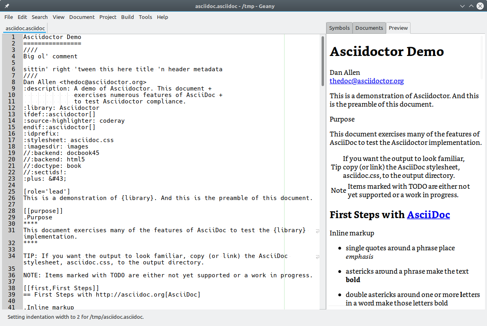

# Preview Plugin for Geany

This plugin provides a basic preview of documents written in several markup formats.



## Features

* Updates the preview as the document is edited
* Supports HTML and Markdown natively
* Supports other document formats via auxiliary programs

## Usage

The preview is active by default for documents with a supported filetype.  Updates are delayed when the preview is not visible.  To disable the preview completely without unloading the plugin, change the filetype to one that is not supported, like a programming language.  The filetype will be automatically redetected as the correct type the next time the document is opened.

To display formats other than HTML or Markdown requires the use of auxiliary programs.  If they are not installed, the preview will not be displayed.  If Geany is running in a terminal, a warning message about the missing program will be printed to stderr.

* [Asciidoctor](https://asciidoctor.org/) is used to process AsciiDoc files.

* [Pandoc](https://pandoc.org/) is used to process the following formats:

  + DocBook
  + LaTeX
  + reStructuredText
  + Textile
  + Txt2Tags
  + DokuWiki, MediaWiki, Tiki Wiki, TWiki

* [Screenplain](https://github.com/vilcans/screenplain) is used to process screenplays written in [Fountain](https://www.fountain.io/).

Custom stylesheets and other settings may changed by editing files in the `geany/plugins/preview` config folder.  Currently, only the stylesheet used by screenplain may be edited.  To reset the stylesheet, delete it.  It will be recreated the next time a fountain document is processed.

## Requirements

This plugin depends on the following libraries and programs:

* [Geany](https://geany.org/)
* [GTK+](http://www.gtk.org)
* [libcmark-gfm](https://github.com/github/cmark-gfm)
* [WebKit2GTK](http://webkitgtk.org)

Optional auxiliary programs may also be used to process additional formats:

* [Asciidoctor](https://asciidoctor.org/)
* [Pandoc](https://pandoc.org/)
* [Screenplain](https://github.com/vilcans/screenplain)

## Building

On Debian/Ubuntu, the following command will install build dependencies:

```
  sudo apt install geany libgtk-3-dev libwebkit2gtk-4.0-dev \
    libcmark-gfm-dev libcmark-gfm-extensions-dev
```

Then to build, run the following in a terminal from the source directory:

```
  ./autogen.sh
  cd build-aux
  ../configure
  make
```

## Installing

To install, run `make install`.  The plugin will be copied to `/usr/local/lib/geany/`.  To uninstall, run `make uninstall`.

To view formats other than HTML or Markdown, install some auxiliary programs:

```
  sudo apt pandoc asciidoctor
```

To view screenplays written in Fountain, install `screenplain`.  Normally `pip` may be used.  However, the version currently available through `pip` does not work with stdio, which this plugin uses to get output from external programs.  The version in the git repository has been fixed.  To install it, run the following commands:

```
  git clone https://github.com/vilcans/screenplain.git
  cd screenplain
  ./setup.py  bdist_wheel
  pip install dist/screenplain-*.whl
```

To uninstall, use `pip uninstall screenplain`

## License

The Preview Geany plugin is licensed under the [GPLv2](COPYING) or later.  It uses code from the [Code Format](https://github.com/codebrainz/code-format/) and [Markdown](https://plugins.geany.org/markdown.html) plugins written by [Michael Brush](https://github.com/codebrainz).
