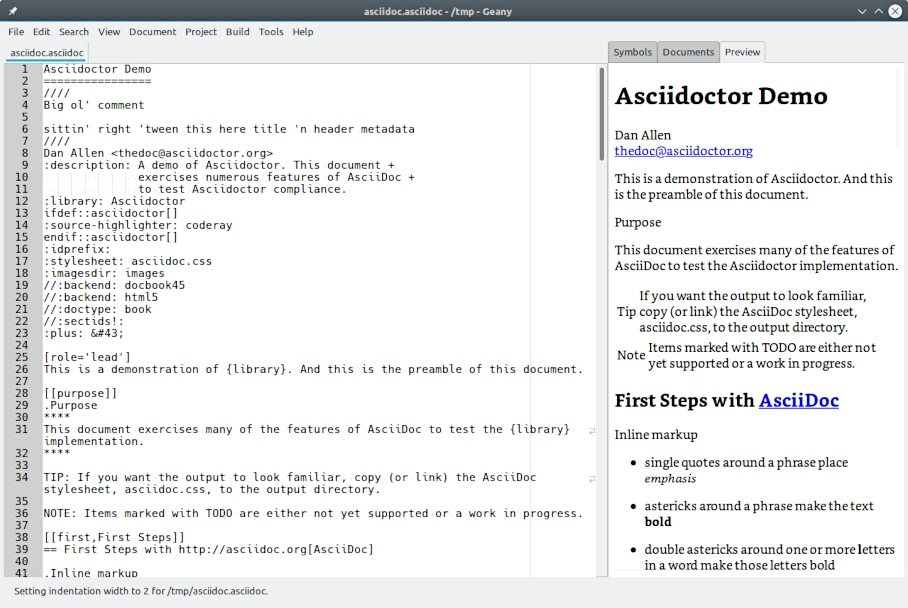

# Preview Plugin for Geany

This plugin provides a preview pane for Geany to view the formatting of several light-weight markup languages as they are edited.

Supported document types include AsciiDoc, DocBook, Fountain, HTML, LaTeX, Markdown, MediaWiki, reStructuredText, Textile, and Txt2Tags.



## Features

* The preview is updated as the document is edited
* HTML, Markdown, and Fountain are supported directly
* Other document formats can be processed with auxiliary programs
* The preview of large documents can be limited to the area being edited
* Rendering of each format can customized with stylesheets
* Dark and light themes are available

## Usage

After installation, enabled the plugin using the Plugin Manager (*Tools/Plugin Manager*).  Since this plugin adds a pane to the sidebar, the sidebar must also be shown (*View/Show Sidebar*).

The preview will be active by default for documents with supported file types.  To display formats other than HTML, Markdown, or Fountain, auxiliary programs are needed.  If they are unavailable, no preview will be displayed for their respective formats.

More about usage and configuration is available at [Certain Queries Answered](docs/CQA.md).

## Installation

### Build from Source

Those interested may try [Building on Linux](docs/Building_on_Linux.md).  Unfortunately, this plugin does not work on Windows because WebKit2GTK is not available.  The plugin has not been tested on Mac.

### Arch (and derivatives)

An AUR package is available at [aur/geany-plugin-preview-git](https://aur.archlinux.org/packages/geany-plugin-preview-git).  Clone the package repository and run `makepkg`.  Then install the package with `pacman -U`.
```
git clone https://aur.archlinux.org/geany-plugin-preview.git
cd geany-plugin-preview
makepkg
sudo pacman -U geany-plugin-preview-git-*.pkg.tar.zst
```

### Ubuntu

This plugin can be installed on Ubuntu from PPA.  The files have not been tested with other Debian-based distributions, but *may* work.
```
sudo add-apt-repository ppa:xiota/geany-plugins
sudo apt-get update
sudo apt-get install geany-plugin-preview
```

## Requirements

This plugin depends on the following libraries and programs:

* [Geany](https://geany.org/)
* [GTK/Glib](http://www.gtk.org)
* [libcmark-gfm](https://github.com/github/cmark-gfm)
* [WebKit2GTK](http://webkitgtk.org)

Optional auxiliary programs may also be used to process additional formats:

* [Asciidoctor](https://asciidoctor.org/)
* [Pandoc](https://pandoc.org/)

## License

The Preview plugin for Geany is licensed under the [GPLv3](License.md) or later.

Some code is taken from the [Code Format](https://github.com/codebrainz/code-format/) and [Markdown](https://plugins.geany.org/markdown.html) plugins, which are written by [Michael Brush](https://github.com/codebrainz) and licensed under the GPLv2+.
