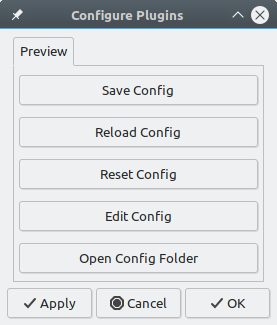

# Certain Queries Answered

## General

> Can Preview be used for web design?

While the Preview plugin can also show HTML, it does not have features that web designers might want, like the devtools console. It is intended as an authoring tool for use with light-weight markup languages, like Markdown. It gives Geany features similar to those found in formiko and retext. If you want to try them, they can both be installed from the repository with apt.

> Will Preview become part of geany-plugins?

Unlikely.  Doing so would limit my ability to add features and fix bugs.

## Usage

> How can I preview documents other than HTML or Markdown?

The Preview plugin uses external programs to process other document types.

* [Asciidoctor](https://asciidoctor.org/) is used to process AsciiDoc files.

* [Pandoc](https://pandoc.org/) is used to process the following formats:

  + DocBook
  + LaTeX
  + reStructuredText
  + Textile
  + Txt2Tags
  + DokuWiki, MediaWiki, Tiki Wiki, TWiki

> Some Markdown editors autosave the document as it is edited.  Can the Preview plugin do that?

Auto saving documents is outside the scope of this plugin.  However, there is another plugin, which is included with Geany, that may do what you want: *Save Actions*

> Is it possible to hide/show the sidebar based on document type, rather than display a message that the document is not supported?

Altering the sidebar's general behavior is outside the scope of this plugin.  However, the sidebar can be auto-hidden based on file type with a GeanyLua script: [auto-sidebar](https://github.com/xiota/geanylua-scripts).

> Is it possible to change the appearance of the sidebar tabs so that it is visibly recognizable when they have focus?

Altering the sidebar's general behavior is outside the scope of this plugin.  However, I have added this capability to another plugin: xi-tweaks.  It is currently available from the PPA.

## Configuration

> Are there any configuration options?

There is a configuration file `preview.conf` that can be edited.  It is located at `~/.config/geany/plugins/preview/`.  The options are documented within the config file itself.

For convenience, the config file and folder may be reached from the Geany menu: *Edit/Plugin Preferences/Preview* or *Tools/Preview*.



> Can I customize the way documents are rendered?

You can edit `css` files in the configuration folder.  Create the files if they do not exist.

* `asciidoctor.css`
* `markdown.css`
* `pandoc.css`
* `pandoc-markdown.css`
* `pandoc-rst.css`
* `pandoc-t2t.css`
* `pandoc-textile.css`
* `preview.css`

W3Schools has a [CSS Tutorial](https://www.w3schools.com/css/) that you may find helpful.

> Is there a dark theme?

You can customize the overall appearance of the Preview pane by setting the `extra_css` option to a `css` file.  A few files are provided:

* `extra-media.css` – This is the default setting.  This file contains `@media` rules that are active when the desktop has a dark theme.  It may not work with all desktop environments.  In some cases, the theme may not always be properly applied.  When switching between light and dark themes, logging out of the desktop manager may be required.
* `extra-dark.css` – This is a dark theme based on colors in the [Sleepy Pastel](https://geany.org/download/themes/) theme.
* `extra-invert.css` – This theme simply inverts all colors.
* `disable` – Use this setting to turn off the setting.

To allow plain text messages to be styled, the stylesheet is applied directly to the webview when the plugin is loaded.  If the stylesheet is edited, click the "Reload Config" button in *Edit/Plugin Preferences/Preview*.

When developing new `css` rules, it's more convenient to use one of the other stylesheets that's refreshed more frequently, like `markdown.css`. Then when you're done, copy the rules to the file you want to use for the `extra_css` option.

> When Geany is first started, the tab is gray before the first Preview is generated.  Is there any way to change the color?

Copy `/usr/share/geany/geany.css` to `~/.config/geany/geany.css`.  Restart Geany after adding rules similar to the following:
```
#geany-preview-sidebar-page {
	background: white;
}
```

> Can Preview show changes without having to scroll?

I would like the preview to automatically scroll to the section being edited, but don't currently know how to program this.

For long documents, there is a snippets mode that shows a preview for only a small section of the document. You can edit the settings in the config file to determine how long the document is before snippets mode activates and how much of the document it shows.

## Installation

> How do I install the Preview plugin?

The Preview plugin for Geany can be installed on Ubuntu from PPA.  The files *may* work with other Debian-based distributions.
```
sudo add-apt-repository ppa:xiota/geany-plugins
sudo apt-get update
sudo apt-get install geany-plugin-preview
```

The plugin can then be enabled in the Plugin Manager (*Tools/Plugin Manager*).  Since this plugin uses the sidebar, the sidebar must also be shown (*View/Show Sidebar*).

> How do I build from source?

Those interested may try [Building on Linux](Building_on_Linux.md).  Unfortunately, this plugin does not currently work on Windows because WebKit2GTK is not available.  Also, the plugin has not been tested on Mac.

## Problems

> My config file doesn't have some options mentioned on this page.  How do I use them?

You probably have an old config file from before some features were added.  You can update the file in the plugin preferences:

1. Click the button that says "Reset Config".  This will replace the old config file with one that has the new options.

2. Click the button that says "Save Config".  This will save your current settings (from your old config) into the new config file.

3. Click "Edit Config" to edit the new settings.

> I updated the plugin now the preview looks different.  What happened?

The preview plugin uses several `css` files.  You probably have a mix of old and new `css` files that do not work well together.  Remove all `css` files from the config folder so the plugin can refresh them with the latest versions.

> Why does the plugin sometimes say "Unable to process type" or display files with strange formatting?

To improve performance, updates are disabled when the preview is not visible or the document is not actively being edited.  This sometimes results in glitches that go away when editing is resumed.  Recent changes have been made to the plugin to reduce how often this happens.

> Why don't HTML documents don't look the same in Preview as in the Chromium (and Firefox)?

Although the rendering engine used by the webview is related to the one in Chromium, it uses a default stylesheet that is different from the one used by Chromium.  The "quirks" modes may also be different.  You can try adding rules to your stylesheet or using a "stylesheet reset".  If formatting is important, test your documents in the target web browsers.

> Why doesn't _____ context menu item work when _____?

The context menu is currently created by the webview.  Making it work as expected will take quite a bit of time and effort.
