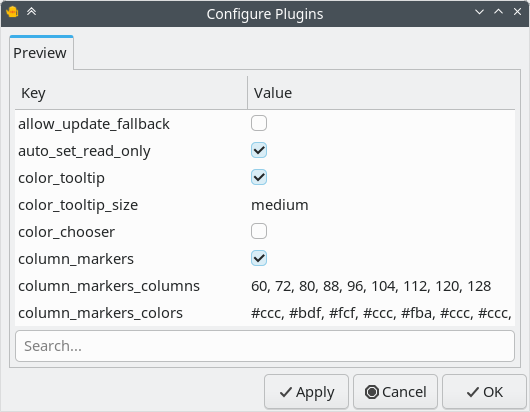

# Preview Plugin for Geany

## User Guide

### Installation

> What operating systems does Preview work with?

This plugin is developed and tested on Linux.  It does not work on Windows and has not been tested on Mac.

> How do I install the Preview plugin?

On Arch Linux.  Prebuilt binaries are available from [Chaotic AUR](https://aur.chaotic.cx/)

Alternatively, you can build from source using packages from the [Arch User Repository](https://wiki.archlinux.org/title/Arch_User_Repository).

* [`aur/geany-plugin-preview`](https://aur.archlinux.org/packages/geany-plugin-preview)
* [`aur/geany-plugin-preview-git`](https://aur.archlinux.org/packages/geany-plugin-preview-git)

> What if I use Debian or Ubuntu?

See [Building on Debian or Ubuntu](Building-Debian.md).

> How do I start the Preview plugin?

After installation, Preview can be enabled in the Plugin Manager (*Tools/Plugin Manager*).  The sidebar must be visible (*View/Show Sidebar*).

> What if I want to build directly from source?

See [Building from Source with Meson](Building-Meson.md).

### Configuration

> Are there any configuration options?

Many.

Open *Edit/Plugin Preferences*, and select the Preview tab.  Each option has a brief description in a tooltip.



> Can I customize the way documents are rendered?

You can edit style sheets in the configuration folder.  Create them if they do not exist.

* `preview.css` – Applies to all files.
* Others are named after the corresponding format.
  * `asciidoc.css`
  * `dokuwiki.css`
  * `markdown.css`

They should be reloaded on demand.  Editing or switching documents may help trigger a refresh.

W3Schools has a [CSS Tutorial](https://www.w3schools.com/css/) that may be helpful.

> Is there a dark theme?

Add a section to `preview.css` similar to the following:

```CSS
/* Default (light theme) */
body {
  background-color: #ffffff;
  color: #222222;
}

/* Dark theme override */
@media (prefers-color-scheme: dark) {
  body {
    background-color: #121212;
    color: #eeeeee;
  }
}
```

### Usage

> How can I preview other document formats?

External programs are used to process other document types.

* [Asciidoctor](https://asciidoctor.org/) is used to process AsciiDoc files.

* [Pandoc](https://pandoc.org/) is used to process the following formats:

  * DocBook
  * LaTeX
  * reStructuredText
  * Textile
  * Txt2Tags
  * DokuWiki, MediaWiki, Tiki Wiki, TWiki

> Some Markdown editors autosave the document as it is edited.  Can the Preview plugin do that?

Auto saving documents is outside the scope of this plugin.  However, another plugin that does what you want is included with Geany: *Save Actions*

### General Questions

> Can Preview be used for web design?

While the Preview plugin can show HTML, it does not have features that web designers might want, like the devtools console. It is intended as an authoring tool for use with light-weight markup languages, like Markdown.

> Will Preview become part of geany-plugins?

No.  Inclusion would limit my ability to make changes.

> Is it possible to hide/show the sidebar based on document type, rather than display a message that the document is not supported?

Altering the sidebar's general behavior is outside the scope of this plugin.

However, changing sidebar behavior based on document type may be possible with a GeanyLua script.

> Is it possible to change the appearance of the sidebar tabs so that it is visibly recognizable when they have focus?

Altering the sidebar's general behavior is outside the scope of this plugin.

Changing widget appearance in response to focus changes is very difficult with GTK3.


### Troubleshooting

> I updated the plugin, and now the preview looks different.  What happened?

The plugin has been completely rewritten (version 0.2.x).  The style sheets in the config folder may need to be revised.  See [Configuration](#Configuration).

> Why don't HTML documents look the same in Preview as in the Chromium (and Firefox)?

The default stylesheet and "quirks" modes may be different from web browsers.  Try using a "stylesheet reset" to improve consistency across browsers.  If precise formatting is important, test documents in the target browsers.

> When Geany is first started, the tab is gray before the first Preview is generated.  Is there any way to change the color?

That is probably the color of the window before the WebView is fully loaded.

I do not know how to change it.

> Can Preview show changes without having to scroll?

Scroll position should be stable after version 0.2.1.
